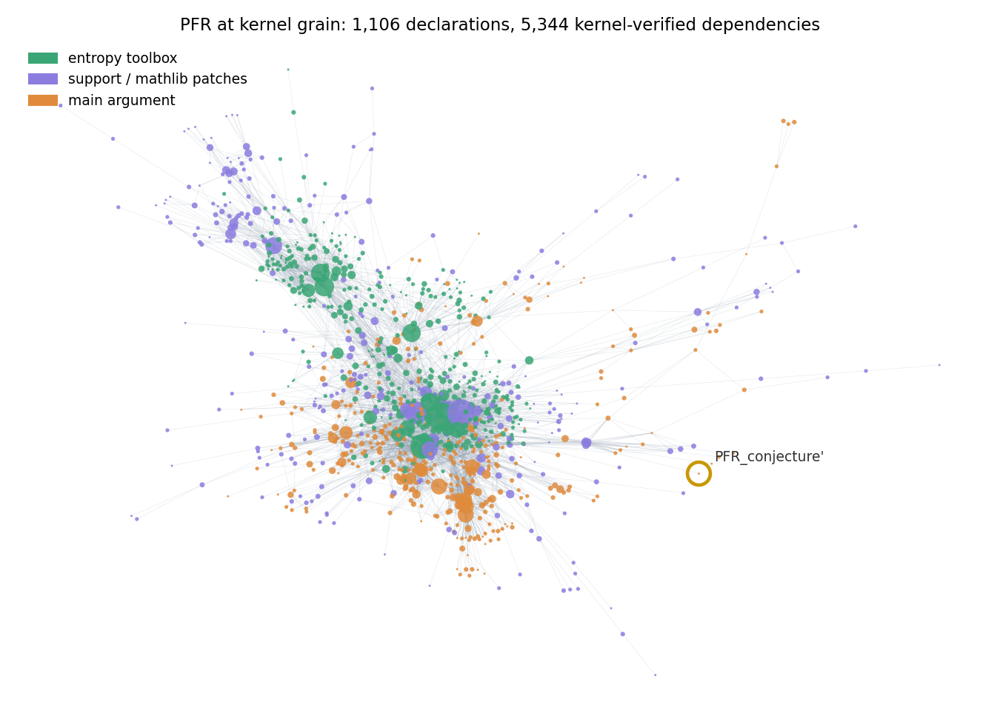

# EPT × AI-era mathematics — analysis pipeline

Extends Viteri & DeDeo, *Epistemic phase transitions in mathematical proofs*
(Cognition 225:105120, 2022) to AI-assisted mathematics (2023–2026). Companion
report — with an interactive proof-network + live Ising belief animation — at
**<https://scottviteri.github.io/ept-ai-analysis/>** (source: `report/report.html`,
served from `docs/`).

> **Status: active, audited research.** The committed graphs, derived data,
> analysis outputs, and live report reproduce the current findings after five
> adversarial audit rounds. Follow-up work—beginning with the full-unfolding
> subterm experiment—is still in progress, so the interpretation may continue
> to sharpen even though the current artifact is reproducible.

> **Licensing status:** the analysis code and report are original work, while
> the committed graphs and results are derived from independently licensed
> public proof corpora. No blanket repository-wide reuse license has yet been
> assigned; the source projects and pinned inputs are identified below.



Analysis date: **2026-07-31**. All inputs are public repositories pinned in
`fetch_repos.sh`. All headline numbers below are **post-audit** (five audit
rounds; see "Audit trail").

**Picking this project up?** Start with
[`handoff/handoff.pdf`](handoff/handoff.pdf) — a 5-page briefing on the current
state of the evidence, the repo map, changed infrastructure assumptions (disk is
no longer scarce; keep builds), and the prioritized next experiments, led by the
full-unfolding subterm test (does dissolving the naming grain change the
human-vs-machine comparison?).

## What we found

1. **Heavy-tailed reuse (α ≈ 2–3) is the signature of *constructed* mathematics,
   human or AI.** Human-led Lean megaprojects (PFR 2.52, FLT 2.47, Sphere 2.97,
   ET human stratum 2.52) and Gauss's agentic AI corpus (2.51; pure-AI Dim24
   subtree 2.55) all show it, and the compiled kernel ground truth agrees
   (2.46 / 2.99 / 2.49 / 2.56 / ET 2.88). Shape caveat from the audit: a Vuong
   test cannot distinguish power law from lognormal on the four smaller tails,
   and the CSN goodness-of-fit rejects the strict power law exactly where the
   data has power (ET, n_tail = 665) — read "α ≈ 2" as *heavy-tailed with hubs*,
   not a certified power law.
2. **Blueprints carry the "Wiles signature."** Within the same projects, the
   informal blueprint networks sit at α ≈ 3.3–4.6 (hub-deficient) while their
   formal twins sit at 2–3. Survives a grain control: Lean graphs contracted to
   file level (blueprint-sized) keep α at 2.1–3.0.
3. **Search-generated proof corpora have measurably different structure — read
   carefully.** ET's machine stratum (24k certificates) is dust (the four
   biggest generation methods have zero internal edges; 95% of machine
   declarations connect to nothing), **but** a controlled test shows the easy
   mass of that task is equally flat for humans (median construction-specific
   support 1 for both). The refined claim: *methods sort instances by depth* —
   search harvests the stratum where dust suffices; every deep instance
   (human counterexample towers: median 33 supporting constructions) was solved
   by construction. On a general library (1,274 matched Mizar theorems),
   Vampire/E proofs are 3× leaner, 71% rerouted off the human premise set, and
   hub-poor (Gini 0.567 vs size-matched human 0.669).
4. **Dependency between strata is one-way.** 200,614 kernel edges flow
   human→machine in ET; **37** flow back (all inspected; the human `Tarski543`
   proof chains nine machine certificates) — 0.15% of certificates were ever
   reused.
5. **The belief model's phenomenology decomposes cleanly.** Degree-matched null
   models: the belief curve is a *degree-sequence* phenomenon; the ΔL₁ firewall
   is a *modularity* phenomenon; acyclicity matters for neither. Dialing α
   parametrically in synthetic graphs moves the onset of collective belief
   exactly as mean-field predicts (ε_c tracks ⟨k²⟩/⟨k⟩: 0.43 at α = 1.8 →
   0.24 at α = 4.0). Heavy tails don't sharpen the transition — an ER graph
   has a *sharper* one at ε ≈ 0.44 — they move certainty's onset to far higher
   error rates, stage the ordering hub-core-first, and make the core bistable.
   What is genuinely transition-like on a finite proof network is *bistability*:
   belief and disbelief are both self-sustaining at every tested ε ≤ 0.46, and
   the prior picks the basin.
6. **The paper's asymmetric model, in 2D:** an EPT exists at every
   β_imp/β_dep ratio from 1:4 to 4:1 (the published symmetric simplification is
   harmless); pure-forward and pure-backward both fail (foundations need
   backward coherence to stay anchored); and backward *refutation* is gated by
   redundancy — clamping the biggest hub false moves its premises 0.000 at any
   ratio, while fragile 1–2-consequence links transmit doubt once abduction
   dominates (mean drop 0.21 at 4:1). Reuse hubs are refutation-proof.
7. **Unfinished proofs (`sorry`) are epistemically cheap where redundant.**
   Blueprints do cover unfinished work (FLT 39% proof-done, Sphere-human 35%,
   PFR 86%); kernel `sorryAx` taint is small (0.7–9.2%; Gauss corpus and ET:
   zero); clamping sorried nodes to disbelief drops downstream belief −0.25 in
   FLT (frontier sorries, few paths) vs −0.07 in Sphere (redundant web).
8. **AI provers converged on the human epistemic architecture in ~2 years.**
   AlphaProof 2024: monoliths, zero named claims. Nexus 2026: 95–97% named
   claims, 3× human naming density.
9. **Tracking fidelity (the correspondence problem, measured):** blueprint edges
   realized as formal dependency paths: PFR 86% > FLT 79% > Sphere 66% >
   ET 43% at kernel grain. Not a graph-density artifact (random tagged-pair
   base rates 2–11%); ET's gap survives kernel measurement — it is real.

## Layout

```
fetch_repos.sh        verify the 11 source snapshots in repos/ (not committed)
sources.lock.tsv      canonical URLs and exact commits for those snapshots
analysis/             the pipeline (Python + two Lean extractors)
graphs/               extracted dependency networks (JSON) — the derived dataset
results/              computed metrics, kernel data, experiment outputs
figs/                 report figures (light/dark pairs) + README network render
report/               report.html (figures + viz data inlined) — the artifact source
docs/                 copy of the report served by GitHub Pages
```

## Pipeline

Extraction:

1. `extract_blueprint.py <blueprint_dir> <out.json>` — leanblueprint LaTeX:
   nodes = `\label{}`ed statements, edges = author-declared `\uses{}`, plus
   `\lean{}` tags and `\leanok` status (informal/communication grain).
2. `extract_lean.py <lean_src_dir> <out.json>` — textual extraction of named
   declarations and cross-references from Lean 4 sources (formal grain,
   uncompiled). Unicode-aware; recognizes the module-system `public` modifier;
   strips strings/comments; short global names match only within their own
   file. High precision (0.77–0.92 vs kernel truth), ~55% recall.
3. `extract_deps.lean` / `extract_deps_legacy.lean` + `kernel_pipeline.sh` —
   ground truth: build the project, load the compiled environment, record per
   constant what its type and proof term use (`Expr.getUsedConstants`).
   Lean 4.33 gotchas encoded: per-module `importAll := true` for private
   oleans; `ConstantInfo.value? (allowOpaque := true)` for theorem bodies.
4. `have_graph.py` — intra-proof claim networks (named vs anonymous `have`s)
   for the AI style analysis.

Analysis (each writes into `results/`):

| script | question |
|---|---|
| `analyze.py` | 2022 battery: α, Q, ΔL₁ firewall, Glauber EPT curves, f₂ |
| `et_split.py`, `et_depth_split.py` | ET strata; the parallel-task confound (depth-sorting) |
| `sphere_compare.py` | human-led vs Gauss-completed sphere packing |
| `track.py` | tracking fidelity (correspondence condition) |
| `kernel_compare.py`, `grain_diff.py` | textual vs kernel grain: precision/recall, hub shifts, missed-edge anatomy |
| `sorry_analysis.py`, `sorry_ising.py` | finished vs unfinished; clamped-disbelief propagation |
| `null_models.py` | degree/modularity/DAG-controlled Ising: what causes what |
| `asymmetric_2d.py` | the paper's asymmetric model in 2D + refutation mechanism |
| `transition_tests.py` | GOF bootstrap; susceptibility/hysteresis; finite-size; the causal α sweep |
| `robustness.py` | Vuong tests, bootstrap CIs, xmin bands, module jackknife |
| `mizar_atp_compare.py` | human vs ATP premise networks on 1,274 matched Mizar theorems |
| `style_summary.py`, `gen_figures.py` | aggregates and figures |

## Reproduce

```bash
python3 -m pip install networkx numpy matplotlib scipy
bash fetch_repos.sh
# textual + blueprint graphs:
python3 analysis/extract_blueprint.py repos/pfr/blueprint graphs/pfr_blueprint.json
python3 analysis/extract_lean.py repos/pfr/PFR graphs/pfr_lean.json
# ... (same pattern for FLT, Sphere-Packing-Lean, mathinc-sphere, equational_theories)
python3 analysis/analyze.py && python3 analysis/et_split.py && python3 analysis/track.py
# kernel grain (per project; builds ~8–10 GB each, cleared afterwards):
bash analysis/kernel_pipeline.sh pfr PFR PFR pfr_lean.json pfr_blueprint.json pfr
# experiments:
python3 analysis/null_models.py
python3 analysis/asymmetric_2d.py
python3 analysis/transition_tests.py all
python3 analysis/robustness.py
python3 analysis/mizar_atp_compare.py
```

The committed `graphs/*.json` and `results/*_kernel_deps.jsonl` are the exact
extractions behind every number, so downstream results reproduce without
building anything.

`fetch_repos.sh` reads `sources.lock.tsv`, fetches each full 40-character
commit directly, checks it out detached, and verifies the resulting `HEAD`.
It never follows a repository's moving default branch. Set `EPT_REPOS_DIR` to
materialize the snapshots somewhere other than `repos/`. The pinned
`JUrban/deepmath` checkout is exposed at `repos/mizar40` for compatibility with
the Mizar comparison script.

## Kernel-grain validation (all five corpora)

| project | kernel N / E | kernel α | textual α | textual precision / recall | tracking kernel (textual) |
|---|---|---|---|---|---|
| PFR | 1,304 / 5,607 | 2.46 ± 0.23 | 2.52 ± 0.28 | 0.92 / 0.52 | **86%** (73%) |
| FLT | 4,723 / 17,147 | 2.99 ± 0.29 | 2.47 ± 0.22 | 0.77 / 0.52 | **79%** (47%) |
| Sphere (human) | 1,483 / 4,535 | 2.49 ± 0.19 | 2.97 ± 0.40 | 0.92 / 0.56 | **66%** (54%) |
| Sphere (Gauss) | 5,452 / 20,739 | 2.56 ± 0.12 | 2.51 ± 0.11 | 0.88 / 0.59 | — |
| Equational Theories | 48,505 / 336,491 | 2.88 ± 0.07 | 2.14 ± 0.10 | 0.905 / 0.60 | 43% (42%) |

External library load: PFR makes 88,790 references into mathlib/core, FLT
263,742, ET 272,961. ET is the one project whose tracking does *not* rise at
kernel grain — its correspondence gap is real.

## Audit trail

Every headline number above survived (or was corrected by) five adversarial
audit rounds, documented in the report's notes and
`results/robustness_summary.json`:

1. **Extractor bugs** (user-prompted graph audit): ASCII-only regexes truncated
   Unicode names; `public` modifier hid 55% of the Gauss corpus; string
   literals made phantom declarations; short names leaked scope. Fixed; all
   numbers recomputed; textual and kernel grains now agree within errors.
2. **Claim verification**: dust verified at kernel grain (machine "internal
   edges" are auto-restatement pairs); the 37 reverse edges all read; blueprint
   extraction hand-checked (42/42); compiler boilerplate negligible.
3. **Statistical robustness**: Vuong + GOF on the power laws; Wiles-signature
   grain control; tracking base-rate control; null-model replication on FLT;
   seed stability; prior-field variant of the asymmetry result.
4. **Parallel-task confound** (user-raised): ET dust is partly the task's
   doing; claim refined to depth-sorting (see finding 3).
5. **Transition existence + the causal α arm** (user-raised): susceptibility /
   hysteresis / finite-size tests; synthetic α sweep; **correction** — the
   earlier "ER blurs the transition" was an ε-grid artifact; ER's transition
   is sharp at ε ≈ 0.44, and the real story is early onset + staged ordering +
   core bistability. Plus the Mizar human-vs-ATP comparison (finding 3).

## Source corpora

`sources.lock.tsv` pins: teorth/pfr, teorth/equational_theories,
ImperialCollegeLondon/FLT, thefundamentaltheor3m/Sphere-Packing-Lean,
math-inc/Sphere-Packing-Lean, AlphaProof IMO-2024 mirror,
google-deepmind/alphaproof-nexus-results, dwrensha/compfiles (human IMO
baseline), JUrban/MPTP2078 + JUrban/deepmath mizar40 (human vs ATP proofs).
